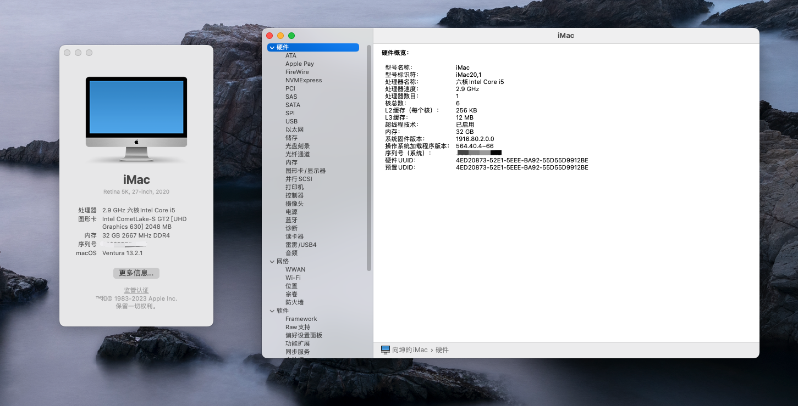

## 硬件配置

| 配置  |  名称 |
|---|---|
| 主板  | 华擎 H410TM-ITX  |
| CPU  |  Intel i5-10400  |
| 显卡  |  核显 Graphics UHD 630  |
| 内存  |  枭鲸 DDR4 2666MHz 16G*2  |
| 硬盘  |  致钛 TiPlus5000 512G  |
| 声卡  |  板载 Realtek ALC235  |
| 有线网卡  |  板载 Realtek RTL8111H  |
| 无线网卡  |  博通 BCM94360CS2 + 转接板  |
| 机箱  |  SKTC TX03  |
| 散热器 | IS-27i |
| 电源 | 雷神G150 19V 150W 5.5mm*2.5mm |

## 黑苹果软件

| 环境  |  版本 |
|---|---|
| MacOS  |  13.2.1  |
| OpenCore  |  0.9.0  |

## 说明
1. 主板侧面HDMI接口需要自行对机箱侧边挖孔, 好在机箱是铝合金很好切割。
2. 建议重新定制USB,删除`/EFI/OC/Kexts/USBToolBox.kext`和`EFI/OC/Kexts/UTBMap.kext`，然后重新[定制USB](https://apple.sqlsec.com/6-%E5%AE%9E%E7%94%A8%E5%A7%BF%E5%8A%BF/6-1/)。

## 工作状态
- [x] 核显正常
- [x] 有线+无线网卡正常
- [x] 蓝牙正常
- [x] 声卡正常
- [x] AirDrop可用
- [x] 风扇+温度传感器正常 

# 已知问题：
|问题| 原因 |解决方案|
|---|---|---|
|开机偶尔卡死logo| 未知 |强制重启恢复|
|开机时如果插上双hdmi，则有其中一个显示器绿屏显示不正常。| 未知 |~~拔掉双hdmi线，只插主板侧边hdmi显示正常，再插主板后端hdmi有概率可以正常双屏显示。~~ 经过测试，只需要在出现绿屏时拔掉两个HDMI接口，然后首先插其中一个，然后再插另一个，此时显示器会闪烁几次，接着就会正常双屏显示。 如果尝试失败可以交换接口插拔顺序。|

## 截图

